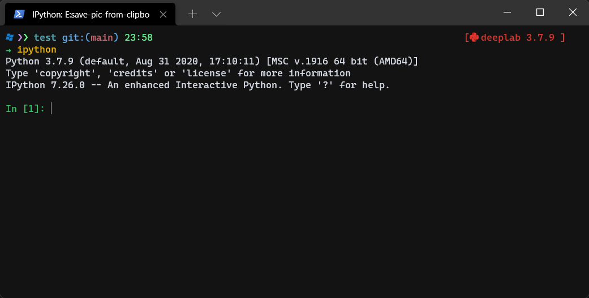

# save-pic-from-clipboard

- [save-pic-from-clipboard](#save-pic-from-clipboard)
  - [how to use](#how-to-use)
  - [how to change folder](#how-to-change-folder)
  - [LICENCE](#licence)
    - [examples](#examples)

## how to use

 ```shell
 git clone [url]
 python save_pic_from_clipboard.py -i -n [file name]
 ```

it will automatically save the pic under the file folder

## how to change folder

example:

```shell
mkdir example
```

```shell
python save_pic_from_clipboard.py --folder example -n [file name]
```

**NOTE:**  You don't need to add suffix like ".jpg" at the end of each file name. It will automatically add when saveing the file. if you want to change the suffix. use arg: --type [pic suffix]

## LICENCE

[MIT LICENCE](LICENSE)


### examples

need a picture


